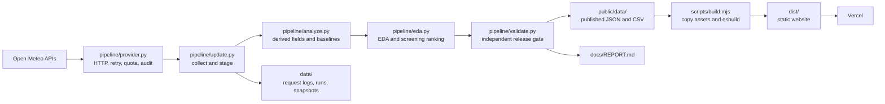

# FloodLens Group A — complete project handover

**Project:** FloodLens Sri Lanka — DS 4004, Option 3: Flood and Extreme Weather Analytics
**Team:** Kasun Vishvajith, Akindu Liyanage, Yasuri Fernando
**Document updated:** 17 September 2026
**Current release:** `20260917T064252Z-1fce2f2a`
**Hosting model:** Static Vercel site, refreshed by GitHub Actions

This document is the technical handover for a new developer, demonstrator, or maintainer. It explains what the system does, how data moves through it, how the browser uses the published release, how to run and deploy it, and what must not be inferred from the indicators.

## 1. Executive summary

FloodLens is a transparent research dashboard for exploring rainfall, weather, modelled river discharge, and unusual conditions at 25 Sri Lankan district reference points. It combines:

- a reproducible Python ingestion and analytics pipeline;
- a static browser application built from React, JavaScript, HTML, and CSS;
- versioned JSON and CSV releases under `public/data/`;
- a daily GitHub Actions refresh with staging and validation; and
- a static Vercel deployment with no long-running backend server.

The current release contains daily records from **2016-01-01 through 2026-09-16**:

| Release fact | Value |
| --- | ---: |
| Sri Lankan reference points | 25 |
| Published daily rows | 97,800 |
| Valid discharge rows | 89,976 |
| Original hourly evidence count | 2,346,600 |
| Algorithmically detected episodes | 731 |
| Baseline | 2016–2026, same calendar month |
| Validation status | Passed |
| Locations without historical discharge | Trincomalee and Mullaitivu |

The original hourly count is retained as provenance. The deployable package stores the compact daily archive, not the original hourly files.

### What the product is

FloodLens is a screening and exploration tool. It helps a user compare local seasonal conditions, inspect historical patterns, see provider forecasts, and identify unusual combinations of rainfall, temperature, wind, and modelled flow.

### What the product is not

It is not an emergency warning service, a calibrated flood-probability model, an inundation map, a district average, a river-basin simulation, or a machine-learning forecasting system. A high signal means that a value is unusual relative to the selected reference point and calendar month; it does not prove that flooding has occurred or will occur.

## 2. System architecture



The important boundary is between `public/data/` and `data/`:

- `public/data/` is the browser-facing release and is copied into `dist/data/` at build time.
- `data/` contains operational evidence and raw-response caches. It is not required by the browser at runtime.
- The Python pipeline runs in GitHub Actions or locally. Vercel only builds and serves static files.

There is no required database, API server, AWS service, RDS instance, Databricks workspace, Docker service, or project-trained model in this edition. `pipeline/spark_check.py` is optional local verification and is not part of the production path.

## 3. Repository map

| Path | Responsibility |
| --- | --- |
| `src/index.html` | HTML shell, sidebar, filters, dialog, accessibility landmarks, and static asset references. |
| `src/main.js` | Frontend entry point; imports the style bundle, interface helpers, and application controller. |
| `src/app.js` | Main browser controller: hash routes, state, rendering, map, filters, historical screens, forecast screens, exports, refresh, and dialog content. |
| `src/views.jsx` | React mounting bridge. It mounts the EDA view and, in the current working tree, the location explorer on the forecast route. |
| `src/pages/Analysis.jsx` | Full-archive exploratory-analysis page backed by `public/data/eda.json`. |
| `src/pages/Explorer.jsx` | On-demand location explorer: Sri Lanka/global search, GPS, coordinate loading, map selection, weather, flow, and elevation. |
| `src/components/analysis-charts.jsx` | React panels, tables, bar lists, annual rate chart, scatter plot, seasonality heatmap, and calendar heatmap. |
| `src/components/time-series.js` | SVG time-series renderer used by historical, flood, event replay, and forecast charts. |
| `src/lib/analytics.js` | Browser-side null-safe statistics, percentile severity, episode grouping, forecast alignment, ordinal formatting, and log-axis conversion. |
| `src/lib/api.js` | Browser fetch wrapper with request de-duplication, remote 15-minute localStorage caching, and a 30-second timeout. |
| `src/lib/page-guides.js` | Per-page “How to read this page” instructions. |
| `src/interface.js` | Responsive navigation, keyboard dismissal, horizontal-scroll hints, chart tooltips, and published-release change detection. |
| `src/styles/` | Theme, layout, component, Apple-style visual, and responsive/accessibility CSS modules. |
| `pipeline/config.py` | Shared paths, archive start date, source variables, and published column order. |
| `pipeline/provider.py` | Serial Open-Meteo client with gzip response storage, retries, `Retry-After`, rate limits, daily quota protection, and JSONL logging. |
| `pipeline/update.py` | Refresh orchestration, hourly-to-daily aggregation, recent overlap collection, forecast snapshots, staging, promotion, and run evidence. |
| `pipeline/analyze.py` | Rolling rainfall, monthly baselines, retrospective midrank percentiles, severity, lag correlations, episodes, and historical CSV generation. |
| `pipeline/eda.py` | Descriptive statistics, histograms, correlation matrices, monsoon/year summaries, scatter data, heatmap data, calendar data, and screening ranking. |
| `pipeline/validate.py` | Independent structural, numerical, analytical, forecast, and geometry checks; writes `validation.json`. |
| `pipeline/report.py` | Generates the short release factsheet at `docs/REPORT.md`. |
| `pipeline/spark_check.py` | Optional local Spark recomputation of rolling and percentile fields. |
| `pipeline/locations.json` | Curated location metadata, coordinates, district, region, and river vicinity labels. |
| `public/data/` | Versioned release consumed by the website. |
| `data/` | Runtime cache, request audit, run reports, refresh status, and saved forecast snapshots. |
| `scripts/build.mjs` | Cleans and rebuilds `dist/`, copies `public/`, copies `index.html`, and creates the esbuild bundles. |
| `tests/` | Python pipeline tests and Node/jsdom frontend integration tests. |
| `.github/workflows/daily-data.yml` | Daily/manual data refresh, validation, build, persistence, and optional Vercel trigger. |
| `vercel.json` | Vercel install/build/output settings and response headers. |
| `docs/` | Methodology, deployment, testing, report, contributions, and this handover. |
| `dist/` | Generated deployment output. Do not edit it manually; it is ignored by Git. |

## 4. Reference locations and geography

The dashboard uses one representative coordinate per district. The coordinate is sampled by the provider onto its model grid, so the returned `weather_grid` and `flood_grid` can differ from the requested coordinate.

| ID | Display name | District | Region | River/context | Historical flow |
| --- | --- | --- | --- | --- | --- |
| `hanwella` | Hanwella | Colombo | Western | Kelani vicinity | Available |
| `ratnapura` | Ratnapura | Ratnapura | Sabaragamuwa | Kalu vicinity | Available |
| `baddegama` | Baddegama | Galle | Southern | Gin vicinity | Available |
| `akuressa` | Akuressa | Matara | Southern | Nilwala vicinity | Available |
| `peradeniya` | Peradeniya | Kandy | Central | Mahaweli vicinity | Available |
| `polonnaruwa` | Polonnaruwa | Polonnaruwa | North Central | Mahaweli vicinity | Available |
| `anuradhapura` | Anuradhapura | Anuradhapura | North Central | Malwathu vicinity | Available |
| `chilaw` | Chilaw | Puttalam | North Western | Deduru vicinity | Available |
| `giriulla` | Giriulla | Kurunegala | North Western | Maha Oya vicinity | Available |
| `kumbukkan` | Kumbukkan | Ampara | Eastern | Kumbukkan vicinity | Available |
| `jaffna` | Jaffna | Jaffna | Northern | Nearby modelled channel, unverified | Available |
| `trincomalee` | Trincomalee | Trincomalee | Eastern | Nearby modelled channel, unverified | Unavailable |
| `batticaloa` | Batticaloa | Batticaloa | Eastern | Nearby modelled channel, unverified | Available |
| `nuwaraeliya` | Nuwara Eliya | Nuwara Eliya | Central | Nearby modelled channel, unverified | Available |
| `mannar` | Mannar | Mannar | Northern | Nearby modelled channel, unverified | Available |
| `hambantota` | Hambantota | Hambantota | Southern | Nearby modelled channel, unverified | Available |
| `badulla` | Badulla | Badulla | Uva | Nearby modelled channel, unverified | Available |
| `kilinochchi` | Kilinochchi | Kilinochchi | Northern | Nearby modelled channel, unverified | Available |
| `mullaitivu` | Mullaitivu | Mullaitivu | Northern | Nearby modelled channel, unverified | Unavailable |
| `vavuniya` | Vavuniya | Vavuniya | Northern | Nearby modelled channel, unverified | Available |
| `monaragala` | Monaragala | Monaragala | Uva | Nearby modelled channel, unverified | Available |
| `gampaha` | Gampaha | Gampaha | Western | Nearby modelled channel, unverified | Available |
| `kalutara` | Kalutara | Kalutara | Western | Nearby modelled channel, unverified | Available |
| `kegalle` | Kegalle | Kegalle | Sabaragamuwa | Nearby modelled channel, unverified | Available |
| `matale` | Matale | Matale | Central | Nearby modelled channel, unverified | Available |

District geometry comes from geoBoundaries `gbOpen` LKA ADM2 data. The map draws district boundaries and point markers. It does not draw flood extent or exposure. Leaflet/OpenStreetMap is used when the map library and tiles load; the app retains a geographic SVG fallback.

## 5. External data sources

| Source | Endpoint/product | Used for |
| --- | --- | --- |
| Open-Meteo Historical Weather | `archive-api.open-meteo.com/v1/archive` | Hourly precipitation, temperature, humidity, wind, and pressure for historical daily aggregation. ERA5 is used for the archive; the recent tail is labelled ECMWF IFS. |
| Open-Meteo Flood API | `flood-api.open-meteo.com/v1/flood` | Daily modelled river discharge from GloFAS; forecast median, p25, and p75 use `forecast_v4` when available. |
| Open-Meteo Forecast API | `api.open-meteo.com/v1/forecast` | Current conditions and a 16-day weather forecast. |
| Open-Meteo Geocoding API | `geocoding-api.open-meteo.com/v1/search` | Place-name search in the location explorer. Search can be restricted to Sri Lanka or expanded globally. |
| Open-Meteo Elevation API | `api.open-meteo.com/v1/elevation` | Terrain context for curated and on-demand locations. |
| geoBoundaries | `geoboundaries.org` / LKA ADM2 | 25 district polygons for the Sri Lanka map. |
| OpenStreetMap | `tile.openstreetmap.org` | Basemap tiles and map attribution. |

Open-Meteo is used without an API key. Location search and on-demand explorer requests are made directly by the browser. Historical collection and saved forecast updates are made by the Python pipeline.

## 6. Published data contract

### 6.1 Location JSON files

Each `public/data/<location-id>.json` file is an object with:

```json
{
  "columns": ["date", "rain", "temp", "humidity", "wind", "pressure", "tmax", "q", "r3", "r7", "qp", "rp", "tp", "wp", "severity", "weather_model", "flow_source"],
  "rows": [["2016-01-01", 0.1, 27.77, 77.75, 16.9, 1013.45, 31.7, 9.54, null, null, 92.52, null, 30.79, 70.23, 0, "ERA5", "GloFAS v4 consolidated"]]
}
```

The column order is part of the contract and is enforced by `pipeline/validate.py`.

| Field | Unit | Meaning |
| --- | --- | --- |
| `date` | UTC date | One consecutive daily key from 2016-01-01 to the current archive end. |
| `rain` | mm | Daily precipitation sum from hourly precipitation. |
| `temp` | °C | Mean daily 2 m temperature. |
| `humidity` | % | Mean daily relative humidity. |
| `wind` | km/h | Maximum daily 10 m wind speed. |
| `pressure` | hPa | Mean daily sea-level pressure. |
| `tmax` | °C | Maximum daily 2 m temperature. |
| `q` | m³/s | Daily modelled river discharge; may be missing. |
| `r3` | mm | Three-day rolling rainfall sum, requiring three valid days. |
| `r7` | mm | Seven-day rolling rainfall sum, requiring seven valid days. |
| `qp` | percentile | Calendar-month midrank percentile of `q`. |
| `rp` | percentile | Calendar-month midrank percentile of `r3`. |
| `tp` | percentile | Calendar-month midrank percentile of `tmax`. |
| `wp` | percentile | Calendar-month midrank percentile of `wind`. |
| `severity` | class | `0` typical, `1` elevated, `2` unusual, `-1` unavailable. Highest available percentile controls the class. |
| `weather_model` | label | Provider/model provenance for the weather row, such as `ERA5` or recent IFS. |
| `flow_source` | label | Provider/model provenance for discharge, such as GloFAS. |

Missing values are intentionally represented as `null` in JSON and blank in CSV exports. Missing does not mean zero.

### 6.2 Supporting published files

| File | Purpose |
| --- | --- |
| `summary.json` | Release ID, dates, counts, locations, source provenance, baseline policy, event list, map source, and limitations. |
| `baselines.json` | Per-location, per-calendar-month p50/p95/p99 thresholds and reference counts for `q`, `r3`, `tmax`, `wind`, and `rain`. |
| `lags.json` | Per-location rainfall-to-discharge correlations for lags 0–7 and paired counts. |
| `eda.json` | Statistics, histograms, correlations, correlation counts, monsoon summaries, annual summaries, monthly heatmap data, scatter data, calendar data, and latest-day screening ranking. |
| `historical-daily.csv` | Combined daily archive with location and district columns for download and external analysis. |
| `current.json` | Saved current conditions and 16-day provider forecasts. Weather and flood retrieval timestamps are stored separately. |
| `forecast-daily.csv` | Flattened saved forecast rows, including weather, rainfall probability, flow ensemble values, and both retrieval timestamps. |
| `validation.json` | Validation status, release ID, counts, missing-flow counts, baseline, and the checks that passed. |
| `districts.geojson` | 25 district features used by the map. |
| `elevation.json` | Saved elevation lookups for curated coordinates. |
| `map-provenance.json` | Geometry source, representation year, attribution, and licence information. |

The browser loads `summary.json`, `districts.geojson`, `baselines.json`, `lags.json`, all 25 location JSON files, and `current.json` during initialization. The analysis route additionally loads `eda.json` when it mounts.

## 7. Data refresh pipeline

### 7.1 `pipeline/config.py`

This is the shared configuration module. It defines:

- the repository root and `FLOODLENS_DATA` override;
- the fixed archive start date, `2016-01-01`;
- the historical weather variables requested from Open-Meteo; and
- `RAW_COLUMNS` and the final `COLUMNS` order.

Using one configuration source prevents the collector, analytics, validator, and CSV writer from drifting apart.

### 7.2 `pipeline/provider.py`

`Client` handles provider interaction. It:

- serialises requests;
- constructs a deterministic SHA-256 URL key;
- writes gzip response files under `data/raw/`;
- records every attempt in `data/request-log.jsonl`;
- retries transient URL, timeout, 429, and 5xx failures up to five attempts;
- respects `Retry-After` when supplied;
- rejects requests above the per-request estimate;
- pauses when the short-window quota would be exceeded; and
- stops when its conservative daily quota is reached.

The response cache is an audit and reuse mechanism. The live update path requests fresh data by default, while callers can provide a cache TTL to reuse a recent stored response.

### 7.3 `pipeline/update.py`

The normal command is `python pipeline/update.py`. Its lifecycle is:

1. Create `data/refresh.lock` using exclusive file creation. A second refresh exits rather than running concurrently.
2. Create a temporary staging directory under `data/floodlens-*` and copy the current `public/data/` release into it.
3. For each location, request a recent overlap ending on the latest completed UTC day. The overlap is up to 14 days and requests are bounded to 31 days per provider call.
4. Request weather in older ERA5 and recent IFS sections, then request GloFAS discharge.
5. Merge the fresh rows with the prior archive, keep the newest row for duplicate dates, and reindex to a complete consecutive daily key.
6. Retrieve weather and flood forecasts for all curated locations. If one forecast provider fails, retain its previous saved snapshot and record the error.
7. Flatten forecasts to `forecast-daily.csv` while preserving separate weather and flood retrieval times.
8. Run `analyze.py`, `eda.py`, and `validate.py` against the staging directory using `FLOODLENS_DATA`.
9. Promote the staged directory to `public/data/` only after all analytical and validation stages pass. A rollback directory is used if the rename fails.
10. Save a run report under `data/runs/`, update `data/refresh-status.json`, save a compressed forecast snapshot, and remove the lock.

The pipeline never fabricates future historical dates. If the existing archive is newer than the requested clock, it refuses to truncate it. If collection or validation fails, the old published release remains in place.

### 7.4 Hourly-to-daily aggregation

`aggregate()` validates the expected provider units, parses timestamps, removes duplicate timestamps by keeping the last copy, and marks values outside broad physical limits as missing. It then calculates:

- precipitation sum;
- mean temperature;
- mean relative humidity;
- maximum wind;
- mean sea-level pressure; and
- maximum temperature.

Each weather field is published only when all 24 hourly observations for that field are valid. A partial day is missing for that field instead of being silently filled. Discharge is kept missing when the flood provider does not return a usable value.

### 7.5 `pipeline/analyze.py`

This module recomputes all derived historical fields from the daily archive. It also rewrites each location JSON, `summary.json`, `baselines.json`, `lags.json`, and `historical-daily.csv`.

The validator calls the same derivation logic independently and compares the stored fields against a fresh recomputation. This catches stale rolling fields, changed percentile policies, and edited release values.

### 7.6 `pipeline/eda.py`

For every location and each of `rain`, `temp`, `humidity`, `wind`, `pressure`, and `q`, it creates:

- valid count, mean, median, standard deviation, p95, minimum, and maximum;
- ten-bin histograms;
- pairwise Pearson correlation values and paired counts;
- monsoon summaries;
- annual valid/unusual/flow-exceedance counts and rates;
- monthly seasonality values;
- up to 600 points for a log-scaled rainfall/discharge scatter plot;
- a daily severity calendar; and
- a latest-day 0–100 screening score for the ranking table.

No model is fitted by this module.

### 7.7 `pipeline/validate.py`

The release gate checks:

- exactly 25 unique districts;
- expected start/end dates and consecutive daily keys;
- stable column order;
- physical ranges;
- rolling rainfall and percentile reconciliation;
- summary row counts;
- score bounds;
- forecast date uniqueness and equal-length arrays; and
- 25 district geometry features.

It writes `public/data/validation.json` only after the checks pass.

## 8. Analytical definitions

### 8.1 Seasonal percentile baselines

Each location is compared with its own full-archive distribution for the same calendar month. This prevents, for example, a wet southwest-monsoon day from being directly compared with a dry-season day.

For a valid value `x`, the percentile is the average of its left and right rank among the monthly reference values. This is a midrank method, so tied values such as repeated zero-rain days receive a meaningful shared percentile rather than all being forced to the minimum. At least 30 valid monthly reference values are required; otherwise the percentile is unavailable.

The stored monthly thresholds are p50, p95, p99, and `n`. They are empirical screening thresholds, not return periods. Adding a new year can change historical ranks because the baseline is retrospective.

### 8.2 Severity classes

The four signals are:

- modelled discharge percentile `qp`;
- three-day rainfall percentile `rp`;
- maximum-temperature percentile `tp`; and
- wind-speed percentile `wp`.

The greatest available signal determines the day:

| Class | Rule | UI meaning |
| ---: | --- | --- |
| `-1` | No usable percentile | No data |
| `0` | Highest percentile below 95 | Typical |
| `1` | Highest percentile at least 95 but below 99 | Elevated / watch |
| `2` | Highest percentile at least 99 | Unusual / high signal |

### 8.3 Rolling rainfall

`r3` and `r7` are trailing three-day and seven-day sums. The first two or six rows remain missing because a complete window is required. Missing daily rainfall is not converted to zero.

### 8.4 Episodes

The default flood-related episode rule marks a day when `max(qp, rp) >= 99`. Consecutive marked days form one episode; a missing day or date gap closes it. The browser supports flood, rainfall, heat, and wind replay variants by applying the corresponding percentile signal.

Episodes are algorithmic groupings of modelled data. They are not independently labelled disasters and must not be presented as confirmed historical floods.

### 8.5 Rainfall–discharge lag

For lag 0 through lag 7, the monthly mean is removed from rainfall and flow first. Earlier rainfall is then compared with later discharge using Pearson correlation. Pair counts are stored beside each correlation. A positive lag suggests an association in this data arrangement; it does not prove causation, account for upstream rainfall, or remove autocorrelation.

### 8.6 Screening score

The latest historical day receives a transparent exploratory index:

| Component | Weight |
| --- | ---: |
| Flood/discharge percentile `qp` | 50% |
| Three-day rainfall percentile `rp` | 30% |
| Maximum of heat `tp` and wind `wp` | 20% |

The result is 0–100 because the inputs are already percentiles. If a component is unavailable, it is omitted and the remaining weights are rescaled. The ranking stores the components, applied weights, and a human-readable basis. A location without usable flow variation cannot receive a flow component.

## 9. Browser application

### 9.1 Startup and state

`src/index.html` provides the shell. `src/main.js` loads CSS, interface behaviour, and `src/app.js`. On startup, `app.js` loads the published data, maps each location’s matrix rows to objects, reads the saved forecast snapshot, and restores a newer browser-local forecast snapshot when it is newer than the bundled one.

The controller keeps the selected route, location, date range, chart metric, map mode, event selection, live snapshot, and replay state in one small state object. Route changes use URL hashes so the application remains a static site.

### 9.2 Active user routes

The current route list in `src/app.js` is:

| Route/hash | Main purpose | Primary data |
| --- | --- | --- |
| `overview` | Sri Lanka map, selected-period rainfall, status cards, and location ranking. | Location JSON, summary, geometry, baselines, saved forecasts. |
| `weather` | Current conditions, 16-day forecast, forecast flags, forecast charts, comparison table, and on-demand explorer. | `current.json`, live APIs, baselines, `GlobalExplorer`. |
| `history` | Daily weather time series, monthly comparison, seasonal baseline, and location comparison. | Location JSON. |
| `flood` | Discharge, rainfall accumulation, lag correlations, episodes, and regional comparison. | Location JSON, `baselines.json`, `lags.json`. |
| `events` | Select and replay algorithmic historical episodes. | Location JSON and browser episode grouping. |
| `analysis` | Distribution, correlation, monsoon, annual, scatter, heatmap, and calendar EDA. | `eda.json`. |
| `quality` | Coverage, methodology, downloads, refresh explanation, and limitations. | Summary and published support files. |

The current working tree mounts `GlobalExplorer` inside the `weather` route. The prior separate `explore` route is retained only as a compatibility hash translation to `weather`; the old `explore` guide/test references should be reconciled before treating the current UI migration as final. At handover time, `src/app.js` and `src/views.jsx` also contain uncommitted changes, so review `git status` before committing or deploying.

### 9.3 Shared filters and exports

The location selector and date inputs are shared across the historical pages. Quick ranges are last 30 days, current year, and full archive. The date range is not applied to forecast, event replay, or project-guide content. Invalid ranges are rejected with feedback.

CSV export is available for historical pages and the forecast page. The analysis route exports the full selected location archive rather than a report. Forecast export includes rain/flow signals and both retrieval timestamps. Missing values remain blank.

### 9.4 Maps and forecast mode

The overview map has two modes:

- **Historical:** marker colour comes from the selected final historical day’s severity.
- **Next 16 days:** marker colour comes from the highest available fresh forecast signal.

The real Leaflet map uses geoBoundaries and OpenStreetMap. If Leaflet or tiles cannot be used, the SVG fallback remains available. In both cases, marker colour describes the sampled model point and never describes flooded area.

### 9.5 Forecast freshness and caching

Saved forecast timestamps are maintained independently for weather and flood. A snapshot older than 24 hours is displayed as stale and does not create forecast flags. A manual refresh forces new provider requests for the selected curated location. A background refresh may run when the tab is online and the selected snapshot is older than 15 minutes.

`src/lib/api.js` de-duplicates simultaneous requests, applies a 30-second timeout, and caches remote browser responses in localStorage for 15 minutes. The app checks `summary.json` periodically and offers a reload when a newer `release_id` is published.

### 9.6 On-demand location explorer

`GlobalExplorer` supports:

- Sri Lanka place-name search;
- optional global place-name search;
- browser GPS, subject to permission;
- latitude/longitude entry;
- map click to fill coordinates;
- current weather and 16-day weather forecast;
- nearby modelled flow forecast;
- 90 m DEM elevation; and
- explicit partial-provider failure handling.

On-demand results are not added to the historical archive or the curated ranking. They are live point forecasts and use the selected model grid, which may not correspond to a named river channel.

## 10. Build, local run, and maintenance

### 10.1 Requirements

- Python 3.10 or newer;
- Node.js 18 or newer;
- npm; and
- network access for live collection, geocoding, elevation, basemap tiles, and on-demand forecasts.

Install the dependencies:

```bash
npm ci
python -m pip install -r requirements.txt
```

On Windows, use `py -3 -m pip install -r requirements.txt` if the `python` launcher is not registered.

### 10.2 Build and serve

```bash
npm run build
python serve.py
```

Then open `http://localhost:8000`. `serve.py` serves `dist/`, not `src/`. Opening `src/index.html` or the source file directly is not a valid test because relative data requests and bundled assets are not available.

`START_WINDOWS.bat` changes to the project directory and launches `serve.py` through `py -3`.

### 10.3 Test commands

```bash
python -m unittest discover -s tests -p '*_test.py'
npm test
npm run check
```

`npm test` rebuilds the site first, then runs the Node tests. The test suite covers numerical safeguards, complete-day aggregation, percentile ties, score weighting, timestamp preservation, atomic promotion, null handling, stale forecasts, episode grouping, ordinal formatting, chart transforms, route rendering, map fallback, filters, exports, missing flow, and forecast date transitions.

### 10.4 Offline and live refresh

Use the offline path when validating the full analytical rebuild without network calls:

```bash
python pipeline/update.py --offline
npm run build
```

Use the live path to collect recent history and provider forecasts:

```bash
python pipeline/update.py
python pipeline/report.py
npm run build
```

The offline path copies and recomputes the existing release but does not collect new provider data. The live path can take several minutes because provider calls are serialised and rate-limited. Never remove `data/refresh.lock` while a refresh is running; only remove it after checking that no refresh process remains and the lock is stale.

### 10.5 Useful evidence files

- `data/request-log.jsonl`: individual provider attempts, status, cache hit, estimated units, bytes, latency, and run ID.
- `data/runs/<run-id>.json`: stage durations, status, release ID, attempt counts, and quota estimates.
- `data/refresh-status.json`: most recent refresh result.
- `data/snapshots/<run-id>.json.gz`: saved forecast snapshot from a live run.
- `public/data/validation.json`: published release gate result.
- `docs/REPORT.md`: generated release factsheet.

Do not commit `data/refresh.lock`, raw request caches, secrets, temporary staging directories, or `dist/`.

## 11. Deployment and automation

### 11.1 GitHub Actions

`.github/workflows/daily-data.yml` runs at **01:35 UTC daily** and supports manual dispatch. It:

1. checks out the repository;
2. installs Python 3.12 and Node 22;
3. installs dependencies;
4. runs Python safeguard tests;
5. performs a staged live refresh and validation;
6. generates `docs/REPORT.md`;
7. builds and tests the website;
8. commits validated `public/data/`, reports, run evidence, snapshots, request logs, and refresh status; and
9. optionally posts `VERCEL_DEPLOY_HOOK` to trigger a Vercel deployment.

The workflow has `contents: write` permission and a concurrency group named `floodlens-data`, so scheduled runs are not allowed to overlap. Failed runs upload `refresh-evidence` for 30 days. A failed refresh does not replace the previous published release.

### 11.2 Vercel

`vercel.json` configures:

```text
Install command: npm ci
Build command:   npm run build
Output directory: dist
```

To deploy:

1. Import the repository into Vercel.
2. Keep the included build configuration.
3. Create a production Deploy Hook in Vercel.
4. Add its URL to the GitHub repository secret `VERCEL_DEPLOY_HOOK`.
5. Run the GitHub workflow manually once and inspect the `refresh-evidence` artifact.

If the secret is absent, the workflow still saves the validated release to GitHub and emits a warning; it cannot automatically redeploy Vercel.

## 12. Validation and current verification notes

The committed `public/data/validation.json` reports `passed` for release `20260917T064252Z-1fce2f2a`. It confirms 25 unique districts, consecutive daily keys, physical ranges, full-archive analytical reconciliation, score bounds, forecast alignment, and 25 geometry features.

The current execution environment used for this handover did not complete the local verification commands: no Python interpreter is installed, and `npm test` stopped during the esbuild build with a Windows path-permission error before the JavaScript tests ran. This is an environment limitation, not evidence that the published validation file failed. Re-run the commands in a normal project checkout with Python and Node installed before submission or deployment.

## 13. Limitations and responsible interpretation

- Weather and flow are modelled products, not local gauge measurements.
- One point does not represent an entire district, river basin, catchment, or population exposure.
- River labels are geographic vicinity labels; the exact modelled channel is not independently verified.
- Trincomalee and Mullaitivu have 3,912 missing historical discharge days each in the current release; weather analysis remains available there.
- Historical percentiles are retrospective and can change when new rows are appended.
- p95 and p99 are empirical screening cut-offs, not 2-, 5-, or 20-year return periods.
- Forecast p25–p75 is provider ensemble spread, not a calibrated confidence interval.
- Forecast weather and historical archive products can differ in grid, model, bias, and retrieval time.
- Episodes have no independently labelled flood-event ground truth.
- The score has no calibration, exposure term, vulnerability term, or observed-flood target.
- The project does not issue official warnings. Users must consult Sri Lankan meteorological and disaster-management authorities for decisions.

## 14. Troubleshooting

| Symptom | Likely cause | Action |
| --- | --- | --- |
| Dataset unavailable in the browser | Site was opened as a file or `dist/` is missing. | Run `npm run build`, then `python serve.py` and open localhost. |
| Forecast unavailable | No saved snapshot or provider failure. | Use **Refresh weather** while online; inspect `data/refresh-status.json` and `data/request-log.jsonl`. |
| Forecast appears stale | Saved weather/flood timestamp is over 24 hours old. | Refresh the selected location; stale values are intentionally excluded from flags. |
| No river chart | Location has no usable flow or the selection has no valid flow rows. | Use a location with flow data or interpret the point as weather-only. |
| Provider quota message | Rate or daily safeguard was reached. | Wait for the quota window and retry; do not remove the guard. |
| Refresh-lock message | Another update is active or a previous process ended abnormally. | Check running processes and the lock age before removing only a confirmed stale lock. |
| Map shows SVG instead of Leaflet | Tile/library loading failed or the browser is offline. | Check network access. The fallback is expected and still supports point selection. |
| New release is not visible | An open tab retains its loaded archive. | Use the banner’s **Load latest data** action or reload the page. |

## 15. Handover checklist

Before a final demonstration or deployment, the maintainer should:

- review `git status`, especially the current uncommitted changes in `src/app.js` and `src/views.jsx`;
- install Python and Node dependencies in a normal checkout;
- run the Python tests, `npm test`, and `npm run check`;
- run `python pipeline/update.py --offline` if analytical code changed;
- inspect `public/data/validation.json` and `docs/REPORT.md`;
- verify the forecast page with a fresh and a deliberately stale snapshot;
- verify Trincomalee and Mullaitivu show missing flow without displaying zero;
- verify the map fallback and the Leaflet map when online;
- confirm the Vercel Deploy Hook is stored as a GitHub secret, never in source;
- confirm `data/refresh.lock`, raw caches, secrets, and `dist/` are not committed; and
- complete the agreed individual contribution details in `docs/CONTRIBUTIONS.md`.

## 16. Related documentation and sources

- [`README.md`](../README.md) — concise project overview and quick start.
- [`METHODOLOGY.md`](METHODOLOGY.md) — data sources, transformations, thresholds, scores, and interpretation.
- [`DEPLOYMENT.md`](DEPLOYMENT.md) — Vercel and local deployment notes.
- [`TESTING.md`](TESTING.md) — test coverage and reproducibility commands.
- [`REPORT.md`](REPORT.md) — generated factsheet for the current release.
- [`CONTRIBUTIONS.md`](CONTRIBUTIONS.md) — contribution evidence guidance.
- [Open-Meteo Historical Weather API](https://open-meteo.com/en/docs/historical-weather-api)
- [Open-Meteo Flood API](https://open-meteo.com/en/docs/flood-api)
- [Open-Meteo Forecast API](https://open-meteo.com/en/docs)
- [Open-Meteo Geocoding API](https://open-meteo.com/en/docs/geocoding-api)
- [geoBoundaries](https://www.geoboundaries.org)
- [OpenStreetMap attribution](https://www.openstreetmap.org/copyright)
